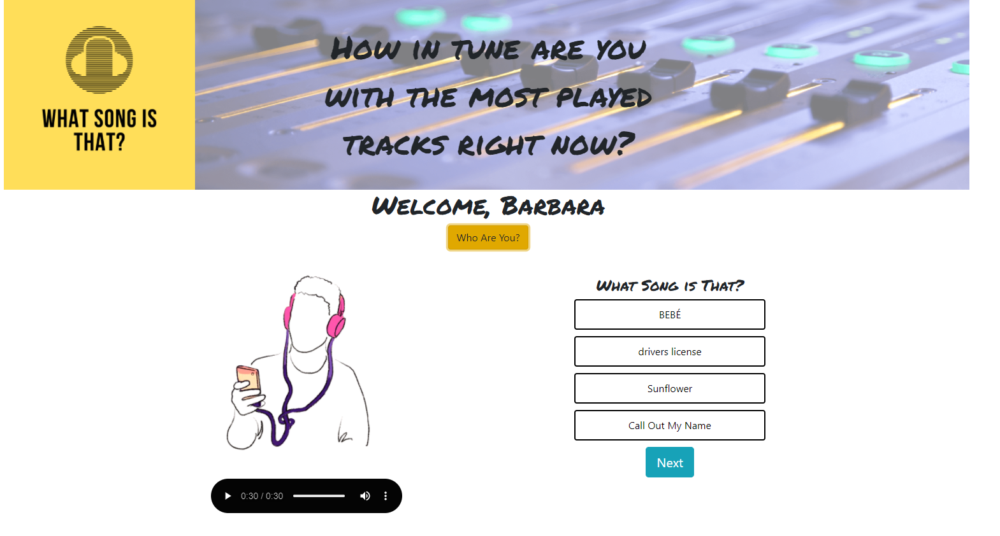

# What Song is That? - Game
A game where you have to guess the title song on a simple music Quiz. 

Live on [Netlify](https://whatsongisthat.netlify.app/)

***

### *__Let's Test your Musical Knowledge?__*

***

## How It Works?
Once you access the website, you will have the option to put your name to play the game, you will need to press play to start hearing the song and guess __What Song is that?__. Four options will be displayed and you should choose which one you think is correct, by the end of the game you will see the total points that you made, and the list of songs that was played.

***
## Technologies Used

- [x] React.js
- [x] Redux (react-redux)
- [x] Deezer Database API
- [x] React-Bootstrap

## Stay Tuned!!
***

